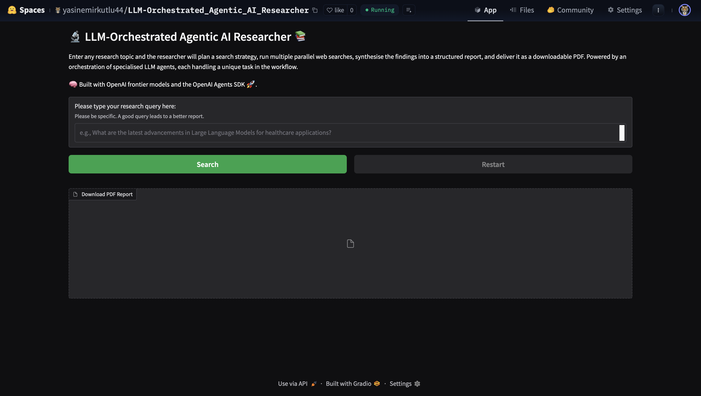
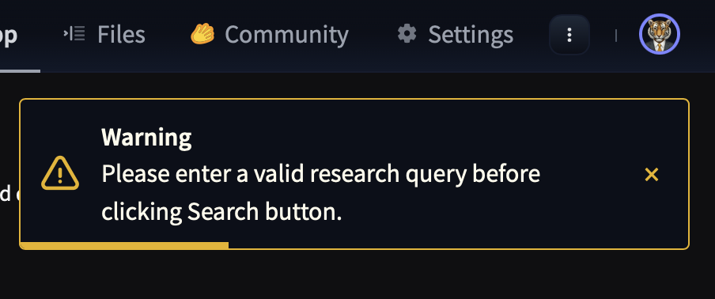
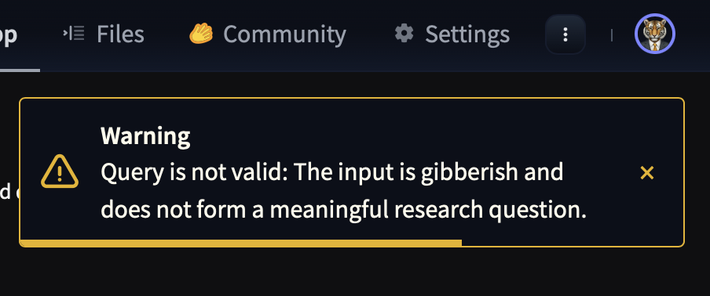
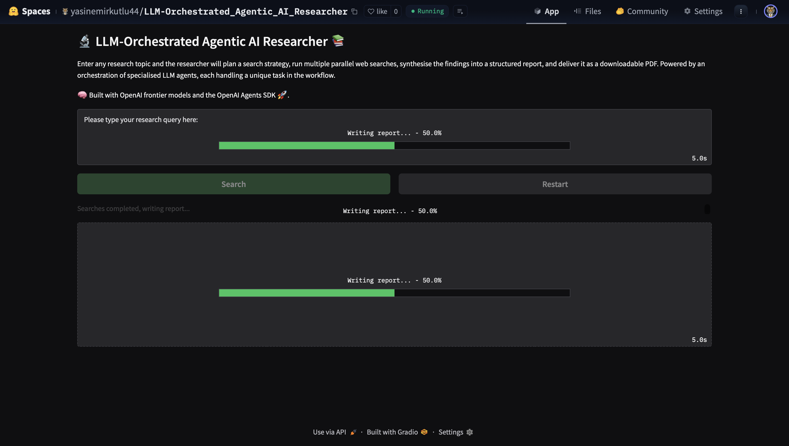
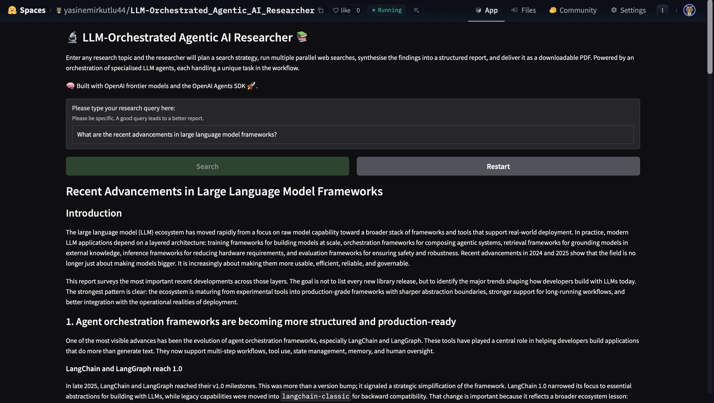
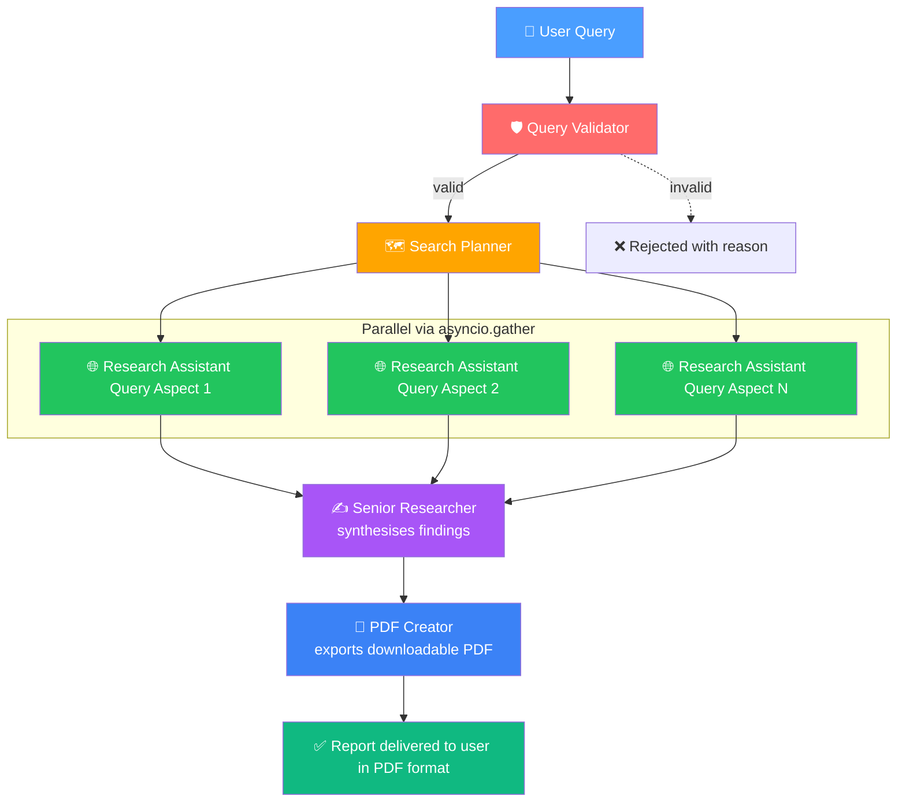

# 🔬 LLM-Orchestrated Agentic AI Researcher 📚

An autonomous researcher that turns any research query into a structured, downloadable PDF report — powered by an orchestration of specialised LLM agents, each handling a distinct step of the workflow.

🚀 **Live demo:** [Hugging Face Space](https://huggingface.co/spaces/yasinemirkutlu44/LLM-Orchestrated_Agentic_AI_Researcher)

> **TL;DR:** Type a research question → get a cited, multi-section PDF report in under a minute.

---

## ✨ What It Does

Enter a research topic and the system will:

1. **Validate** your query to ensure it's meaningful and actionable.
2. **Plan** a set of complementary web searches covering different aspects of the research query. For example, for *"recent advancements in Large Language Models"*, the planner might produce one search on multimodal capabilities and another on agentic reasoning benchmarks.
3. **Search** the web in parallel across each of those aspects.
4. **Synthesise** the findings into a structured markdown report.
5. **Export** the report as a downloadable PDF.

All progress is streamed to the UI in real time, with a progress bar tracking each stage.

---

## 🖼️ Screenshots

### Home screen


### Input validation
Empty or nonsensical queries are rejected with a clear warning — no wasted API calls.


### Input validation — gibberish query
Gibberish queries are not accepted.


### Live progress
Each stage of the pipeline updates a progress bar in real time.


### Generated report
The synthesised report appears inline alongside a PDF download button located at the end of the markdown text.


---

## 🧠 Agent Architecture

The system orchestrates five specialised agents, each with a single responsibility and typed outputs (via Pydantic) for reliable data flow between them.

| Agent | Role | Output |
|-------|------|--------|
| 🛡️ **Query Validator** | Decides whether the user's query is a meaningful research question or gibberish. Blocks empty/nonsensical inputs before any expensive calls. | `QueryValidationInput` (`is_valid`, `reason`) |
| 🗺️ **Search Planner** | Breaks the query into targeted, complementary search terms covering different aspects of the research query. | `WebSearchPlan` (list of `WebSearchItem`) |
| 🌐 **Research Assistant** | Performs a web search for each planned term and returns a dense 2–3 paragraph summary. Runs in parallel across all search items. | Summary text per search |
| ✍️ **Senior Researcher** | Synthesises all search summaries into a cohesive, multi-section markdown report (~1,500+ words). | `ReportOutline` (`summary`, `report`, `suggested_questions`) |
| 📄 **PDF Creator** | Renders the markdown report as a styled PDF and saves it to disk. | File path to the generated PDF |

All orchestration happens in the **`Orchestrator`** class (`LLM_Orchestrator.py`), which coordinates the agents and streams progress updates to the UI via an async generator.

---

## 🏗️ How It Works



Parallel search execution via `asyncio.gather` keeps latency low. Pydantic schemas at each agent boundary guarantee the next agent receives well-formed, validated data.

---

## 🚀 Running Locally

**1. Clone the repo**

```bash
git clone https://github.com/yasinemirkutlu44/LLM-Orchestrated-Agentic-AI-Researcher.git
cd LLM-Orchestrated-Agentic-AI-Researcher
```

**2. Install dependencies**

```bash
pip install -r requirements.txt
```

**3. Set your OpenAI API key**

Create a `.env` file in the project root:

```
OPENAI_API_KEY=sk-...
```

**4. Launch the app**

```bash
python application.py
```

The UI opens in your browser at `http://localhost:7860`.

---

## 💡 UX Details

- **Input validation** — empty, too-short, or nonsensical queries are rejected before any API calls, with a clear toast message.
- **Live progress bar** — each stage updates a percentage (20% → 50% → 75% → 95% → 100%) so users see what's happening.
- **Locked inputs during run** — the Run button and textbox disable mid-run to prevent double-submission.
- **Restart button** — clears the session and returns to a fresh state.
- **PDF download** — the generated report is immediately available as a downloadable file.

---

## 🧩 Design Notes

- **Why split into agents?** Each agent has focused instructions and a narrow output type, making outputs more reliable than a monolithic prompt. It also mirrors how real research workflows are structured.
- **Why Pydantic outputs?** Structured outputs remove fragile text parsing between stages. The planner returns `WebSearchPlan`; the writer returns `ReportOutline` — the orchestrator never has to guess.
- **Why direct function call for PDF?** The `PDF Creator` tool is logically an agent, but functionally just file I/O. Calling the underlying function directly (skipping the LLM) is faster, cheaper, and deterministic.

---

## 🔮 Possible Extensions

- Save markdown report alongside PDF for easy editing
- Persistent history of past reports (sidebar)
- Configurable number of search angles
- Option to select between frontier models (Claude, Gemini, etc.)
- Mid-run cancel button

---

## 📜 License

MIT — feel free to fork, adapt, and build on top of this.

---
🧠 **Built with OpenAI frontier models and the OpenAI Agents SDK** 🚀
---
